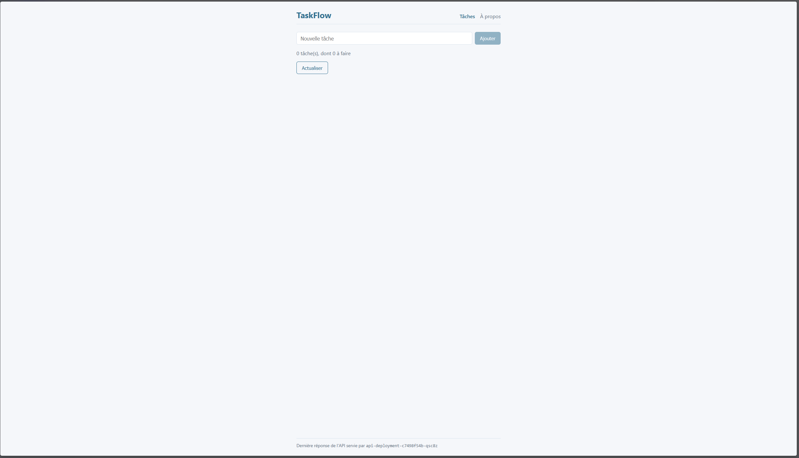

## Séance 5 — TaskFlow de bout en bout sur Kubernetes

### Livrable du point de contrôle

```cmd
kubectl get deployments,services -n taskflow
NAME                               READY   UP-TO-DATE   AVAILABLE   AGE
deployment.apps/api-deployment     2/2     2            2           116m
deployment.apps/db-deployment      1/1     1            1           116m
deployment.apps/front-deployment   2/2     2            2           102m

NAME            TYPE           CLUSTER-IP      EXTERNAL-IP   PORT(S)          AGE
service/api     ClusterIP      10.43.222.104   <none>        3000/TCP         116m
service/db      ClusterIP      10.43.152.220   <none>        5432/TCP         116m
service/front   LoadBalancer   10.43.226.25    172.25.0.3    9000:31400/TCP   102m
```

- Capture du navigateur sur `http://localhost:9000` : 
- Manifestes : [k8s/app/](../k8s/app/)

### Résumé

Update de la version de l'image api 1.0.0 -> 2.0.0 et push sur docker hub
Création k8s/app avec le namespace taskflow et suppression du dossier pods et son suivi dans git.
Création des déploiment et services db.yaml puis api.yaml et front.yaml gestion de leur port.
Cluster recréé avec le port 9000 publié

### Questions de l'énoncé

#### Étape 1 — Nettoyage et organisation

**Pourquoi supprimer les Pods avant de créer les Services ? Que feraient les Services api et db de Pods qui portent déjà les mêmes labels ?**
Pour éviter l'utilisation des vieux pods, le service irait résoudre les vieux pod car il porte le même label, ils seraient ajoutés aux endpoints du Service, et le trafic serait réparti entre eux et les nouveaux Pods.

**kubectl apply -f sur un dossier suit l'ordre alphabétique. Comment nommer le fichier du namespace pour que tout fonctionne sur un cluster vierge ?**
On le renomme en ajoutant un chiffre au début pour le faire passer en premier (table ASCII).

#### Étape 2 — Base de données

**Combien de réplicas ? Quelle stratégie convient à un composant qui ne supporte pas deux instances simultanées, et pourquoi ?**
1, la stratégie Recreate car aucune cohabitation de deux versions différentes (évite les conflits de schéma de base de données).

**Le Service doit porter le nom que l'API utilisera pour joindre la base. Quel nom fallait-il utiliser avec Compose en séance 1 ? (Il doit être le même ici.)**
Le nom qu'il fallait utiliser avec compose est celui définit dans le service "db".

**Quel type de Service pour un composant qui ne doit pas être joignable depuis le poste ?**
ClusterIP, l'IP n'existe qu'à l'intérieur du cluster

#### Étape 3 — API

**Que devient la valeur de l'hôte de la base ?**
Ce n'est plus l'IP, mais son nom "db" résolu grace a CoreDNS dans le service

**Quel nom et quel port pour le Service ?**
Le nom doit être api pour correspondre au nom dans le fichier de config nginx et le port 3000 celui de l'api.

**Les questions sur le piège, si tu le rencontres : la cause, deux façons de corriger, et le type YAML d'un nombre dans env.**
La variable DB_PORT doit être un entier positif (valeur reçue : "tcp://10.43.24.10:5432")
il faut déclarer DB_PORT dans le env du container api.
error when creating "k8s/app/api.yaml": Deployment in version "v1" cannot be handled as a Deployment: json: cannot unmarshal number into Go struct field EnvVar.spec.template.spec.containers.env.value of type string
Le port doit être déclaré comme une string.
C'est le kubelet de DB qui injecte les variables d'env avec EnableServiceLinks qui prend la syntaxe de docker.
Désactiver l'injection avec enableServiceLinks: false dans la spec du Pod 
J'ai choisi de déclarer le port dans le container pour eviter d'avoir une option en plus et savoir directement sur quel port et la db dans la conf de l'api

** Comment constater que les deux réplicas reçoivent du trafic ?**
Crée un pod temporaire avec curl pour rentrer dans le cluster
```cmd
k run boucle -n taskflow --rm -it --restart=Never --image=curlimages/curl:8.11.1 -- sh
```
Puis faire une boucle d'appel cur dans le shell pour voir les deux pods s'alterner.
```cmd
for i in $(seq 1 10); do curl http://api:3000/healthz -sI | grep X-Served-By ; done
```
X-Served-By: api-deployment-6d78d6d66c-5kbvl
X-Served-By: api-deployment-6d78d6d66c-5kbvl
X-Served-By: api-deployment-6d78d6d66c-5kbvl
X-Served-By: api-deployment-6d78d6d66c-5kbvl
X-Served-By: api-deployment-6d78d6d66c-w8ldl
X-Served-By: api-deployment-6d78d6d66c-w8ldl
X-Served-By: api-deployment-6d78d6d66c-5kbvl
X-Served-By: api-deployment-6d78d6d66c-w8ldl
X-Served-By: api-deployment-6d78d6d66c-w8ldl
X-Served-By: api-deployment-6d78d6d66c-5kbvl

#### Étape 4 — Front

Quel port choisir pour le Service ?
Un port libre. J'ai choisi 9000 pour ma propre convention > 9000 cluster.
Pas 80 ni 443 car, utilsé par Traefik et 8080 utiliser par mon compose si jamais je le relance.

**Quel port de conteneur le Service doit-il viser ?**
le port 80 qui est ecouter par nginx

**Que se passe-t-il au démarrage du conteneur Nginx si le Service api n'existe pas encore ?**
le container renverra une erreur.

**Que se passe-t-il ensuite ?**
Nginx plante au démarrage (« host not found in upstream api »), puis kubelet le redémarre jusqu'à ce que le Service api existe.

**Quel ordre d'application évite ce redémarrage ?**
L'ordre alphabétique api -> db -> front 

**Si EXTERNAL-IP  reste <pending>  : quel Pod est concerné, et que disent ses événements ?**
Le Pod svclb-front-… dans kube-system. Événement : didn't have free ports, car le port 80 est pris par Traefik.

**Si la page ne s'affiche pas depuis le poste alors qu'elle répond depuis la VM : quel élément du système de la VM peut filtrer le port ?**
Le pare-feu de la VM

**Ouvrir l'application dans le navigateur du poste. Créer une tâche, la marquer comme terminée, recharger la page. Après plusieurs actualisations, le pied de page affiche-t-il des noms d'instances différents ?**
Oui, c'est normale on la vue avec le curl avant le service renvoi sur un pod au hasard en essaient de répartir. 

#### Étape 5 — Auto-réparation et mise à jour de l'API

**Quel effet visible dans le navigateur ?**
Aucun

**Que s'est-il passé côté cluster ? Regarde dans le terminal -w : combien de Pods, quels noms, dans quel ordre ?**
Quand ont supprime un pod 6274f celui-ci passe en Terminating l'autre 9tssh en Pending puis ContainerCreating le supprimer passe en Completed et un nouveau arrive nb9gk en Running.
Il est recréé, car le ReplicaSet, set en voit 1 au lieu de 2.


**Les deux versions cohabitent-elles pendant la mise à jour ?**
Oui les deux versions cohabitent.

**Des requêtes échouent-elles ? Si oui, à quel moment et pourquoi ?**
le front ne reste pas en panne, il y a eu un 502 pendant la bascule.

**Comment rendre le déploiement plus prudent avec la stratégie**
Grace a la stratégie rollingUpdate, avec les réglages maxUnavailable: 0 et maxSurge: 1.

**Revenir à la version 1.0.0 avec `kubectl rollout undo`, puis rendre le fichier cohérent avec le cluster (`kubectl diff`).**
Après le `rollout undo`, `kubectl diff -f k8s/app/api.yaml` montrait `- image: ...:1.0.0` (cluster) et `+ image: ...:2.0.0` (fichier) : un prochain `apply` aurait remis la 2.0.0. Fichier remis en 1.0.0, `kubectl diff` est vide.

**Le Pod de base est-il recréé ? L'API retrouve-t-elle la base sans modification de configuration ? Pourquoi ?**
Oui, le Deployment recrée le Pod avec une nouvelle IP. L'API le retrouve sans rien changer, car elle passe par le nom du Service `db`, qui reste stable.

**Les tâches existent-elles toujours ? L'application répond-elle correctement aux requêtes de lecture sur `/api/tasks` ?**
Non, les tâches ont disparu, et `/api/tasks` renvoie `500 Erreur interne`. Log de l'API : `relation "tasks" does not exist`. La base est neuve et vide, et l'API ne crée la table qu'à son démarrage. Il faut redémarrer l'API : `kubectl rollout restart deployment/api-deployment -n taskflow`. Pas de persistance : la séance 7 y répond.
